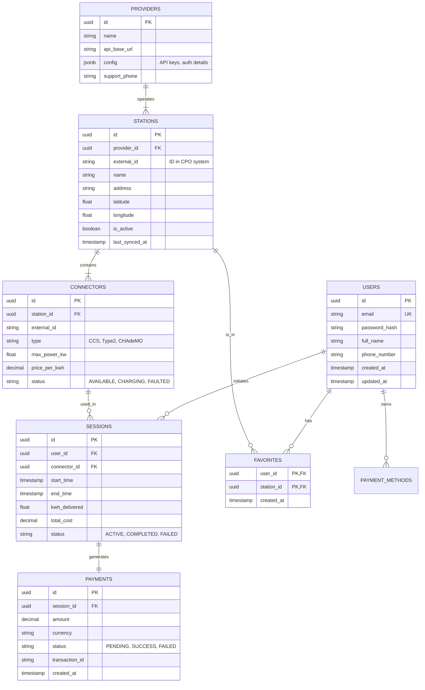

# Database Schema Design

## 1. ER Diagram

## 2. Table Definitions

### 2.1 Users
Stores user account information.
- **id**: Primary Key (UUID).
- **email**: Unique email address.
- **password_hash**: Bcrypt/Argon2 hash.
- **full_name**: User's display name.
- **phone_number**: Contact number (optional).

### 2.2 Providers (CPOs)
Stores configuration for different Charging Point Operators (Ignitis, Elinta, etc.).
- **config**: JSONB column to store provider-specific API credentials flexibly.

### 2.3 Stations
Represents a physical charging location.
- **external_id**: The ID used by the CPO to identify this station.
- **last_synced_at**: Timestamp of the last successful data fetch from CPO.

### 2.4 Connectors
Represents a specific plug at a station.
- **status**: Real-time status (synced frequently or fetched on demand).

### 2.5 Sessions
Records charging history.
- **kwh_delivered**: Updated periodically during charging and finalized at the end.

### 2.6 Payments
Records financial transactions linked to sessions.
