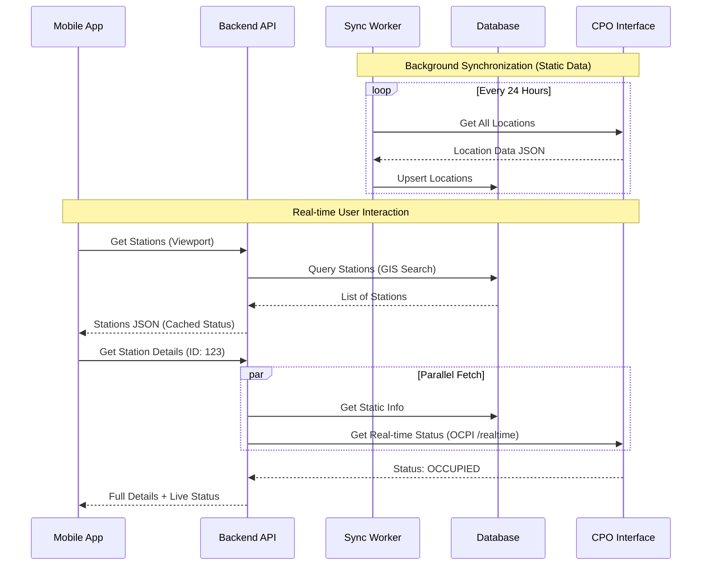

# Data Flow Diagram (DFD) - Data Update Strategy

## 1. Overview
This document outlines the data flow for the "Energy Eniwhere" application, specifically focusing on how data is acquired, updated, and synchronized between Charging Point Operators (CPOs), our Backend, and the Mobile App.

## 2. Data Categories
We distinguish between two types of data with different update requirements:
1.  **Static/Slow-Moving Data**: Station location, address, connector types, power output, pricing structure.
    *   *Update Frequency*: Low (Daily/Weekly or on change).
2.  **Dynamic/Real-Time Data**: Connector availability (Occupied/Free), current charging session status.
    *   *Update Frequency*: High (Real-time or near real-time).

## 3. Level 1 DFD: System Context

```mermaid
graph TD
    User[Mobile App User]
    Backend[Energy Eniwhere Backend]
    DB[(PostgreSQL Database)]
    CPO[CPO APIs (Ignitis, Elinta, etc.)]
    
    %% Static Data Sync
    CPO -- "1. Station Details (Periodic/Webhook)" --> Backend
    Backend -- "2. Upsert Station Data" --> DB
    
    %% User View
    User -- "3. Request Stations (Map View)" --> Backend
    Backend -- "4. Query Cached Stations" --> DB
    DB -- "5. Return Station List" --> Backend
    Backend -- "6. Return Stations" --> User
    
    %% Real-time Status
    User -- "7. Request Status (Specific Station)" --> Backend
    Backend -- "8. Live Status Check" --> CPO
    CPO -- "9. Return Status" --> Backend
    Backend -- "10. Return Real-time Status" --> User
```

## 4. Detailed Data Update Strategies

### 4.1 Static Data Synchronization (The "Aggregator" Model)
To ensure fast map loading, we cannot query CPO APIs for every map move. We must maintain a local copy of station data.

*   **Strategy**: **Periodic Polling + Webhooks (if available)**
*   **Flow**:
    1.  **Cron Job (Nightly)**: Backend fetches full station list from CPO.
    2.  **Diff Analysis**: Compare with DB. Update changed records, insert new ones, mark missing as "Out of Service".
    3.  **Optimization**: Use CPO "OCPI" (Open Charge Point Interface) `versions` endpoint if available to fetch only changes.

### 4.2 Real-Time Availability (The "Proxy" Model)
Availability changes too fast to cache effectively for long periods.

*   **Strategy**: **Lazy Loading / Just-In-Time Proxy**
*   **Flow**:
    1.  **Map View (Clustered)**: Show availability based on *last known status* (updated every ~5-10 mins via background job for visible regions) OR show generic icons.
    2.  **Station Detail View**: When user taps a station:
        *   Backend immediately requests fresh status from CPO.
        *   Returns live status to App.
    3.  **Active Session**: WebSocket or Polling (every 5s) during active charging.

## 5. System Architecture for Data Updates



## 6. Architecture Decisions
1.  **Data Strategy**: Hybrid Model (Local DB for static, Real-time for dynamic) - *DECIDED via ADR-001*.
2.  **Staleness Tolerance**: < 15 mins for map view availability cache.
3.  **Protocol**: OCPI (Open Charge Point Interface) preferred for all CPOs.

## 7. Data Entities & Collection

### 7.1 Station Data (Public/Static)
*   **Station ID**: Unique identifier.
*   **Operator Info**: Name, Support Phone, Website.
*   **Location**: Latitude, Longitude, Address, City.
*   **Access**: Public/Private, Opening Hours.

### 7.2 Connector Data (Dynamic)
*   **EVSE ID**: Unique ID for the specific plug.
*   **Type**: Connector standard (CCS, Type 2, CHAdeMO).
*   **Power**: Max voltage (V), amperage (A), power (kW).
*   **Status**: `AVAILABLE`, `CHARGING`, `OCCUPIED`, `OUTOFORDER`, `UNKNOWN`.
*   **Tariff**: Price per kWh, price per minute, session fee.

### 7.3 User Data (Private)
*   **Identity**: Email address, User ID (UUID).
*   **Security**: Hashed password (if not using social login only).
*   **Preferences**: Filter settings (preferred connector types, min power).
*   **Location**: Real-time GPS coordinates (Used for map centering only, **NOT STORED**).

### 7.4 Session & Payment Data (Transactional)
*   **Session Info**: Start time, End time, Total kWh consumed.
*   **Financial**: Total cost, Currency, Payment Method Token (PCI DSS compliant - stored by payment provider, not us).
*   **History**: List of past charging sessions for the user.
