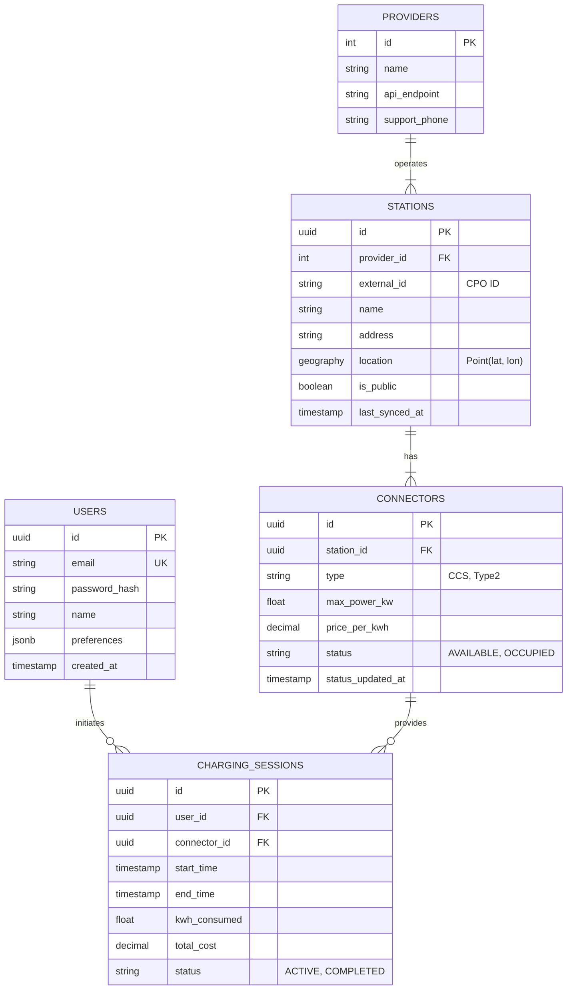

# Software Requirements Document (SRD)

## 1. Introduction
This document translates the requirements from the PRD and the architecture from the DFD/ADR into concrete technical specifications for the development team.

## 2. Technology Stack
*   **Mobile App**: Flutter (Dart)
*   **Backend**: Node.js (TypeScript) with Express/NestJS (TBD)
*   **Database**: PostgreSQL 15+ with PostGIS extension (for geospatial queries)
*   **Infrastructure**: Docker, Docker Compose

## 3. Database Schema Design
Based on the DFD Data Entities.

### 3.1 ER Diagram (Mermaid)

## 4. API Specification (REST)

### 4.1 Stations API
*   `GET /api/v1/stations`
    *   **Query Params**: `lat`, `lon`, `radius` (km), `filters` (connector_type, min_power).
    *   **Response**: List of stations (compact JSON for map).
    *   **Logic**: Query PostGIS DB.

*   `GET /api/v1/stations/:id`
    *   **Response**: Full station details + **Real-time Status**.
    *   **Logic**: Fetch static data from DB + Parallel fetch to CPO API for live status (Hybrid Strategy).

### 4.2 Charging API
*   `POST /api/v1/charging/start`
    *   **Body**: `{ connector_id: "..." }`
    *   **Logic**: Authenticate user -> Validate Payment Method -> Call CPO Start Session -> Create DB Session Record.

*   `POST /api/v1/charging/stop`
    *   **Body**: `{ session_id: "..." }`
    *   **Logic**: Call CPO Stop Session -> Update DB Record -> Process Payment.

*   `GET /api/v1/charging/active`
    *   **Response**: Current session status (kWh, time, cost).

### 4.3 User API
*   `POST /api/v1/auth/register`
*   `POST /api/v1/auth/login`
*   `GET /api/v1/users/me/history`

## 5. Security Implementation
*   **Passwords**: Bcrypt or Argon2 hashing.
*   **API Auth**: JWT (JSON Web Tokens) with short expiry + Refresh Tokens.
*   **Payment Data**: Never touch raw card numbers. Use Stripe/Adyen SDKs to get a `payment_method_id` token.

## 6. Development Roadmap
1.  **Phase 1: Foundation**: Setup DB, Basic Auth, CPO Integration Mock.
2.  **Phase 2: Map & Discovery**: Sync Worker, Map API, Mobile Map UI.
3.  **Phase 3: Charging**: Real-time Proxy, Start/Stop logic, Payments.
