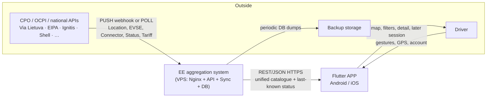
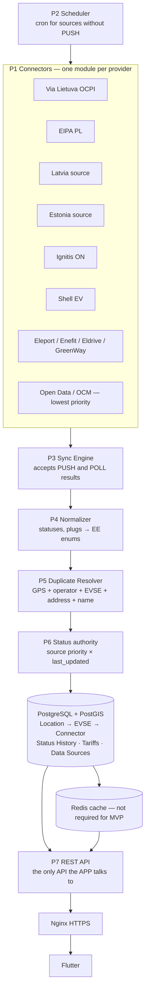
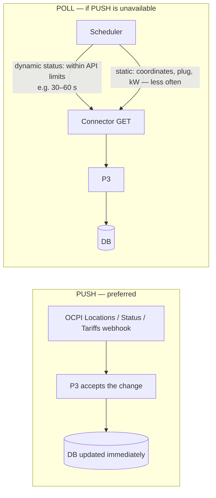
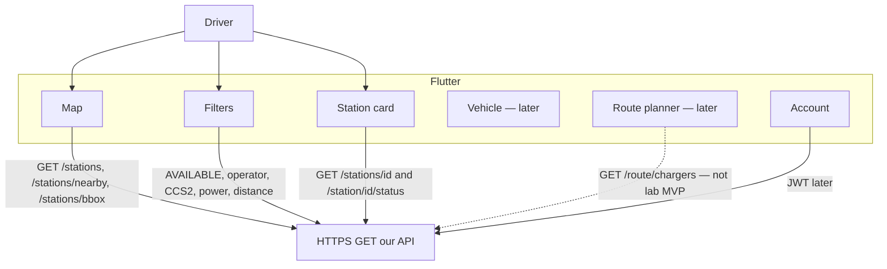
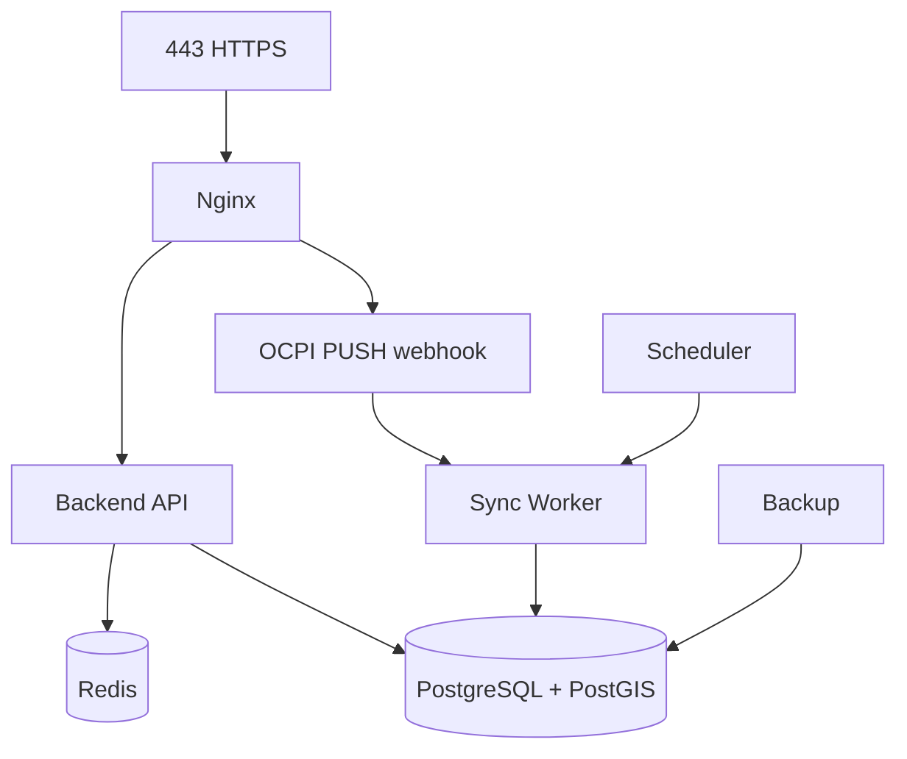

# DFD — Aggregation server and APP architecture

**Status:** production / online target (PRD §10).  
**Lab today:** Flutter → Node Express → Prisma → PostgreSQL; OCM pull; occupancy `UNKNOWN`. That is **not** this DFD.

Canon: [docs/PRD.md](../PRD.md) §10.

Language: English, same as the PRD, SRD, and ADRs. The lab working notes in `PROBLEMS.txt` stay Lithuanian.

---

## 0. What this DFD proves

The mobile APP **does not** call operator APIs, OCPI hubs, or national registries.

All catalogue data follows:

```
Operator APIs / OCPI / national registries
  → Connectors
  → Sync Engine
  → Normalizer
  → Duplicate Resolver
  → PostgreSQL / PostGIS
  → Redis (optional at MVP start)
  → our REST API
  → Flutter APP
```

---

## 1. Level 0 — system context

External actors: CPOs and registries (data **into** EE), the driver (Flutter), backup storage.



**Forbidden:** Flutter → Ignitis / Shell / EIPA / Nominatim as a station catalogue source. (Map tiles and Google Sign-In remain third-party SDKs, not the catalogue.)

---

## 2. Level 1 — backend processes



### P1 Connector

Talks to **one** source, takes raw data, hands it to P3. A new operator is a new connector, **without** rewriting the APP.

### P4 Normalizer

| In the source | Inside EE |
|-----------|-----------|
| AVAILABLE / Available / FREE / available | `AVAILABLE` |
| CCS / CCS2 / Combo 2 / IEC_62196_T2_COMBO | `CCS2` |

Internal EVSE/connector statuses: `AVAILABLE`, `OCCUPIED`, `CHARGING`, `RESERVED`, `OUT_OF_ORDER`, `OFFLINE`, `UNKNOWN`.

The model stays **close to OCPI**, even when the source is REST or CSV.

### P5 Duplicate Resolver

The same physical site from Via Lietuva + Shell + Ignitis is **not** four pins. One internal `Location`; every `source` + `source_location_id` remains an alias.

### P6 Priority (when sources disagree)

1. Direct CPO API  
2. National registry  
3. Roaming (GIREVE, Hubject)  
4. Aggregator (e.g. Shell)  
5. Static Open Data (OCM)

Priority **alone** is not enough — always compare `last_updated`. A fresher lower-rank source can beat a stale higher-rank one.

---

## 3. Level 2 — PUSH and POLL



Static fields (coordinates, address, type, max kW) are not synced every 30 s.

If a CPO is unreachable, the APP still gets **last-known** status + `last_updated` — not an empty map.

---

## 4. APP data flows (client)

The APP talks **only** to our API. It does not know whether a row came from Via Lietuva, Shell, or EIPA.



### Endpoints (production)

| Method | Purpose |
|---------|-----------|
| `GET /stations` | Catalogue |
| `GET /stations/{id}` | Detail |
| `GET /stations/nearby` | Radius (PostGIS) |
| `GET /stations/bbox` | Map viewport |
| `GET /operators` | Operators |
| `GET /connectors` | Plug dictionary |
| `GET /station/{id}/status` | Last-known + `last_updated` |
| `GET /route/chargers` | Route chargers (after catalogue) |

### Filters (server filters, not only the client)

AVAILABLE · operator · CCS2 · CHAdeMO · Type 2 · AC/DC · min kW · distance · price later.

Example: **CCS2 + ≥150 kW + AVAILABLE** within 20 km of a point.

### Station card

Operator, address, distance, total / free / occupied connectors, each connector (type, kW, status), **Updated: N sec ago**. If data is too old — `UNKNOWN` or “unreliable”.

---

## 5. Database (flow store)

Three layers that must not be collapsed into one “Station” row in production:

```
Location (physical site)
  └── EVSE (charge point)
        └── Connector (plug, power, AC/DC, status)
```

Tables: Countries, Operators, Locations, EVSE, Connectors, Status History, Tariffs, Data Sources, Users, Vehicles, Trips.

On each object: `ee_id` + `source` + `source_*_id`.

PostGIS: “free CCS2 ≥150 kW within 20 km” and “stations within 5 km of the Vilnius–Warsaw line”.

---

## 6. MVP VPS (one server)



Start: OVH VPS 2 vCPU / 4 GB RAM / 40–80 GB NVMe / Ubuntu / Docker. No Kubernetes. Split components later if needed.

---

## 7. MVP sequence (data view)

1. VPS + Docker + Postgres/PostGIS  
2. API + Location → EVSE → Connector  
3. **One** real LT source: Location + EVSE + Connector + Power + real-time Status into the DB and the APP  
4. Filters + map  
5. PL, then LV, then EE  
6. Only then: Users/JWT, vehicle, server-side route, tariffs, START/STOP, payments  

The first technical goal is step 3. Without it, online work is not complete.

---

## 8. Lab vs this DFD

| Flow | Lab 2026-09 | This DFD |
|---------|-------------|---------|
| APP → CPO | No (already correct) | No |
| Catalogue | OCM pull, Prisma `Station`+`Connector` | Connectors + OCPI model |
| Status | always `UNKNOWN` | last-known + `last_updated` |
| Dedup | upsert by name | Duplicate Resolver |
| GIS | points in the app | PostGIS `nearby` / `bbox` |
| Hosting | Mac + Colima :5433 | OVH VPS + Nginx HTTPS |
| API language | Node Express | FastAPI (production MVP) |

The old “JIT proxy to the CPO on every detail tap” (ADR-001 dynamic path) is **no longer the primary** path: status lives in the EE DB. Detail may *additionally* request a fresh refresh, but the map always has last-known.
