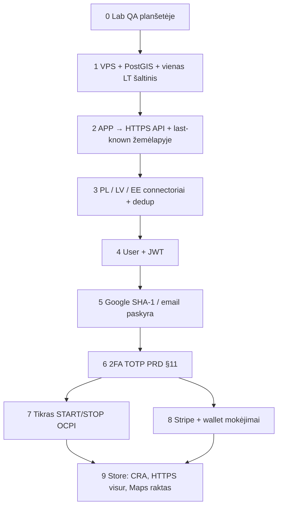

# Darbų planas pagal priklausomybes

**Data:** 2026-09-05  
**Taisyklė:** kito etapo nepradėti, kol neuždarytas ankstesnis *vartai* (⚡).  
**Dabar nedaryti:** PRD §11 2FA, Stripe live, store listing — kol nebaigtas lab QA ir §10 pirmas LT šaltinis.

Kanona: [PRD.md](../PRD.md) §9 lab IA, §10 ingest, §11 2FA; [DFD.md](DFD.md).

---

## Vartotojų prioritetas (2026-09-05) — virš kitų darbų

Pirmi atsiliepimai. Šitie keturi dalykai **svarbesni** už trip poliravimą, iOS, store, 2FA, Stripe wallet. Techninė eilė žemiau lieka — be ingest nėra kainos ir užimtumo.

| # | Ką vairuotojas nori | Lab dabar | Kada tampa tiesa |
|---|---------------------|-----------|------------------|
| **U1** | **Kainos žemėlapyje** — matyti iš smeigtuko, ne tik detalėje | **LAB LT:** hibridas € zoom≥16, kortelė, detalė (Via Lietuva) | VPS + visos rinkos |
| **U2** | Filtras: **galia** ir **kaina min–max** (€/kWh) | **LAB:** kW + € Lowest/Highest kliente | **2.3** serveris |
| **U3** | Stotelėje **užimtumas** (laisva / užimta / kraunasi) | **LAB LT** last-known; LV/EE/PL UNKNOWN | Vartai B visoms rinkoms |
| **U4** | **Start** šiame app ir **gyvas progresas** (kWh, laikas, kaina) | Lab Start/Stop, įvertinimas | **6.1–6.2** (po Vartų B + D) |

**Produktinis MVP vairuotojui** = U1 + U2 + U3. U4 — kai yra tikras CPO startas. Be U1–U3 žemėlapis lieka „smeigtukai be kainos ir būsenos“.

---

## 0. Dabar — laboratorinis QA (planšetė SM-T585)

**Tikslas:** įsitikinti, kad *esamas* lab veikia. Jokių 2FA / FastAPI / Stripe.

| # | Darbas | Priklauso nuo | Atlikta kai |
|---|--------|----------------|-------------|
| **0.1** | Trip: Vilnius→Riga, Google žemėlapis (be „API KEY REQUIRED“), Navigate | API :3000, `adb reverse` | TABLET OK |
| **0.2** | Automobilis: Save & Continue → ACTIVE kortelė; po restart vis dar Active; trip naudoja km/kWh/kištuką | 0.1 nebūtina, lygiagrečiai | TABLET OK |
| **0.3** | Ne Skip: sąrašas → stotis → Start/Stop → Payments istorija | API + sesija | TABLET OK |
| **0.4** | Mark a new station + Owner PIN 2468 + atvykimas Yes/No/Dismiss | 0.3 | TABLET OK |
| **0.5** | Sign out uždaro app; kitas startas be Sign out — README ir Account praleidžiami | 0.2 | TABLET OK |

⚡ **Vartai A:** 0.1–0.5 OK. Tik tada VPS / naujas backend.

---

## 1. Online katalogas — pirmas realus šaltinis (PRD §10, pirmas techninis tikslas)

Be to nėra gyvo užimtumo, AVAILABLE filtro ir tikro CPO.

| # | Darbas | Priklauso nuo |
|---|--------|----------------|
| **1.1** | OVH VPS (2 vCPU / 4 GB), Ubuntu, Docker, Nginx HTTPS, atsarginės kopijos | Vartai A, paskyra OVH |
| **1.2** | PostgreSQL + **PostGIS** serveryje | 1.1 |
| **1.3** | Schema **Location → EVSE → Connector** + `source` / `source_*_id` + `last_updated` + Status History | 1.2 |
| **1.4** | REST API: `GET /stations`, `/{id}`, `/nearby`, `/bbox`, `/station/{id}/status` | 1.3 |
| **1.5** | **Vienas LT connector** — Location+EVSE+Connector+galia+**statusas**+**tarifas (€/kWh)** į DB | 1.4 + sutartis / raktai **tik serveryje** |
| **1.6** | PUSH jei yra; kitaip POLL pagal API limitus | 1.5 |

⚡ **Vartai B:** APP gali parodyti LT stotelę su **kaina**, **Available/Occupied** ir **Updated N sec ago** iš mūsų API. Tai U1 + U3 duomenų pusė.

Lab Node/OCM Mac’e palikti, kol 1.6 veikia; tada APP `API_BASE` → HTTPS VPS.

---

## 2. APP prie gamybos API + last-known UI

| # | Darbas | Priklauso nuo |
|---|--------|----------------|
| **2.1** | Flutter `API_BASE` = HTTPS (be `usesCleartextTraffic` release) | Vartai B |
| **2.2** | Žemėlapis: **kaina ant smeigtuko / kortelės** (U1); detalė: užimtumas + last_updated (U3); per seni → UNKNOWN | 2.1 |
| **2.3** | Filtrai serveryje: galia (min kW) + **max €/kWh** (U2) + AVAILABLE | 2.2 + PostGIS |

---

## 3. Kitos rinkos ir dedup

| # | Darbas | Priklauso nuo |
|---|--------|----------------|
| **3.1** | Lenkija (EIPA ar CPO) | Vartai B |
| **3.2** | Latvija | 3.1 nebūtina griežtai; po 1.5 šablono |
| **3.3** | Estija | kaip 3.2 |
| **3.4** | Duplicate Resolver + šaltinių prioritetas | ≥2 šaltiniai tai pačiai vietai |

OCM lieka žemiausias prioritetas, ne vienintelis katalogas.

---

## 4. Vartotojas serveryje (be 2FA)

Reikia prieš automobilį debesyje, crowd su tikru id, erase, ir prieš §11.

| # | Darbas | Priklauso nuo |
|---|--------|----------------|
| **4.1** | `Users` lentelė | 1.3 (ta pati DB) |
| **4.2** | JWT access (kol kas galima ilgesnis lab; gamyboje 10–15 min su refresh — §11) rašymo API | 4.1 |
| **4.3** | Firebase **SHA-1** + tikras Google Sign-In; išimti lab-device **store** flavour | 4.2 (gali startuoti lygiagrečiai su 1.x, bet store be 4.2 negalima) |
| **4.4** | Vehicle į serverį, susietas su User | 4.1 + 0.2 |
| **4.5** | Email + slaptažodis, **Argon2id** (dar be TOTP UI) | 4.1 |

⚡ **Vartai C:** prisijungęs user, JWT, nebėra atviro crowd POST.

---

## 5. 2FA ir tokenai (PRD §11) — tik po vartų C

**Nedaryti anksčiau:** sulaužytų dabartinį QA.

| # | Darbas | Priklauso nuo |
|---|--------|----------------|
| **5.1** | TOTP, encrypted secret, recovery codes | 4.5 |
| **5.2** | Access 10–15 min + Refresh Keystore/Keychain, revoke visos sesijos | 4.2 |
| **5.3** | Rate limit login/2FA/reset; aktyvios sesijos / sign out all | 5.2 |
| **5.4** | Biometrika tik atrakinti tokeną įrenginyje | 5.2 |
| **5.5** | Politika: 2FA **privaloma** mokėjimams ir START/STOP | 5.1, prieš 6 ir 7 |

⚡ **Vartai D:** pavogtas slaptažodis be TOTP neįeina į jautrias operacijas.

---

## 6. Tikras krovimas (OCPI)

| # | Darbas | Priklauso nuo |
|---|--------|----------------|
| **6.1** | OCPI credentials, start/stop sesija pas CPO | Vartai B + D |
| **6.2** | Gyvas progresas app: kWh, laikas, einamoji kaina — ne lab-estimate (U4) | 6.1 |
| **6.3** | Step-up 2FA ant START/STOP | 5.5 + 6.1 |

---

## 7. Mokėjimai

| # | Darbas | Priklauso nuo |
|---|--------|----------------|
| **7.1** | Production HTTPS (jau 1.1 / 2.1) | Vartai B |
| **7.2** | Stripe test key, Payment Sheet, webhook | 7.1 + Vartai D |
| **7.3** | Apple Pay (kitas Mac / iPhone) ir Google Pay | 7.2 + iOS/Android store tapatybė |
| **7.4** | PCI SAQ A įrodymai, jokių PAN loguose | 7.2 |

---

## 8. Maršrutas serveryje (ne lab sketch)

| # | Darbas | Priklauso nuo |
|---|--------|----------------|
| **8.1** | SoC įvestis + kelios stotelės pagal nuotolį ir kištuką | 2.3 + 4.4 |
| **8.2** | `GET /route/chargers` su last-known occupancy | 8.1 + Vartai B |
| **8.3** | Kaina / trukmė kai yra tarifai | 6.2 arba tarifų connector |

---

## 9. iOS (kitas Mac)

Lygiagrečiai nuo **2.x**, bet Apple Sign-In / Apple Pay — po 4.3 ir 7.3. Šis Mac Xcode nepilnas.

---

## 10. Store / rinka (paskutinis)

Tik kai 2.1, 4.3, ir jei listing’e yra pinigai — Vartai D + 7.x.

| # | Darbas |
|---|--------|
| **10.1** | Išimti lab PIN, Skip bypass, cleartext iš **release** |
| **10.2** | Maps raktas: package + SHA-1 / iOS bundle |
| **10.3** | CRA Art. 14 kontaktas, CVD, SBOM CI, DPIA, sutikimo žurnalas |
| **10.4** | MASVS/ASVS peržiūra, pinning politika |
| **10.5** | Play / App Store listing; CE nuo 2027-12-11 jei rinkoje |

---

## 11. Kokybė (įterpti, ne gale vienu gabalu)

Po **1.4** — API testai. Po **2.2** — Flutter testai žemėlapiui. `./scripts/scan-cve.sh` prieš kiekvieną release.

---

## Ko nedaryti dabar (sąmoningai)

- 2FA UI / Argon2id / TOTP (laukti 5.x)
- Kubernetes, Redis (Redis po apkrovos)
- ISO 27001, keli CPO vienu metu prieš 1.5
- `flutter upgrade` (3.32.8)

---

## Šios savaitės vienas sakinys

**LT U1–U3 lab padaryta (Via Lietuva, ne VPS). Toliau: planšetės QA hibridui/€ filtrui; U4 ir VPS lieka.**
